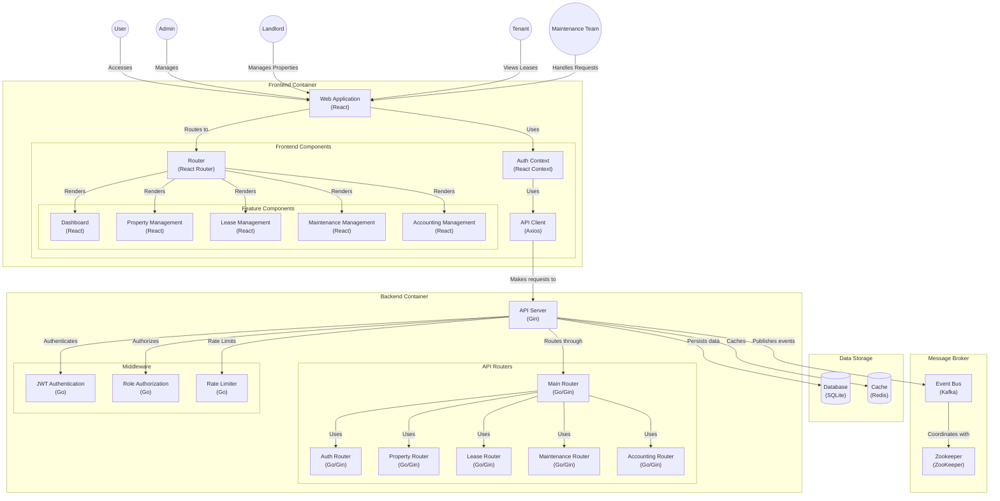

# Property Management System (PMS) Documentation

A RESTful API for managing rental properties, leases, maintenance requests, and accounting. Built with **Go**, **Gin**, **GORM**, **Redis**, **Kafka**, and **JWT**.

---

## Table of Contents
1. [Overview](#overview)
2. [Architecture](#architecture)
3. [Setup](#setup)
4. [API Endpoints](#api-endpoints)
5. [Security](#security)
6. [Caching](#caching)
7. [Event-Driven Architecture](#event-driven-architecture-with-kafka)
8. [Error Handling](#error-handling)
9. [Rate Limiting](#rate-limiting)
10. [Conclusion](#conclusion)

---

## Overview
The system supports four user roles:
- **Admin**: Full access to all features.
- **Landlord**: Manages properties, leases, and maintenance.
- **Tenant**: Views leases, submits maintenance requests.
- **Maintenance Team**: Updates maintenance request statuses.

### Key Features
- JWT-based authentication/authorization
- Redis caching for performance
- Kafka for event-driven maintenance workflows
- Role-based access control (RBAC)
- Pagination, filtering, and rate limiting

---

## Architecture


### Tech Stack
- **Backend**: Go 1.20, Gin
- **Database**: SQLite (GORM)
- **Cache**: Redis
- **Messaging**: Apache Kafka
- **Auth**: JWT

---

## Setup

### 1. Prerequisites
- Go 1.20+
- Docker
- Kafka (local or broker URL)

### 2. Docker Setup
```bash
# Start Redis and Kafka
docker-compose up -d
```

**docker-compose.yml**:
```yaml
version: '3'
services:
  redis:
    image: redis:alpine
    ports:
      - "6379:6379"
  kafka:
    image: bitnami/kafka:latest
    ports:
      - "9092:9092"
    environment:
      - KAFKA_ENABLE_KRAFT=yes
      - KAFKA_CFG_NODE_ID=0
      - KAFKA_CFG_PROCESS_ROLES=controller,broker
      - KAFKA_CFG_LISTENERS=PLAINTEXT://:9092
      - KAFKA_CFG_ADVERTISED_LISTENERS=PLAINTEXT://localhost:9092
```

### 3. Environment Variables
```env
JWT_SECRET=your_jwt_secret_here
KAFKA_BROKER=localhost:9092
REDIS_ADDR=localhost:6379
```

### 4. Run the Server
```bash
go run main.go
```

---

## API Endpoints

### Authentication
| Method | Path       | Description          | Sample Request |
|--------|------------|----------------------|----------------|
| POST   | `/login`   | Login with credentials | [View](#login) |
| POST   | `/register`| Register new user    | [View](#register) |
| POST   | `/refresh` | Refresh access token | -              |
| POST   | `/logout`  | Invalidate JWT token | -              |

#### **Login Request**
```json
POST /login
{
  "username": "john_doe",
  "password": "securepassword123"
}
```

#### **Register Request**
```json
POST /register
{
  "username": "john_doe",
  "password": "securepassword123",
  "email": "john@example.com",
  "role": "tenant"
}
```

---

### Properties
| Method | Path                | Role       | Description              |
|--------|---------------------|------------|--------------------------|
| GET    | `/properties`       | All        | List properties (filtered) |
| POST   | `/properties`       | Admin/Landlord | Create property       |
| PUT    | `/properties/:id`   | Admin/Landlord | Update property       |
| DELETE | `/properties/:id`   | Admin/Landlord | Delete property       |

**Sample Property Object**:
```json
{
  "name": "Downtown Apartment",
  "address": "123 Main St",
  "price": 2000.00,
  "owner_id": 1,
  "available": true
}
```

---

### Leases
| Method | Path                | Role       | Description              |
|--------|---------------------|------------|--------------------------|
| POST   | `/leases`           | Admin/Landlord | Create lease         |
| GET    | `/leases/active`    | Tenant      | Get active lease         |
| DELETE | `/leases/:id`       | Admin/Landlord | Delete lease         |

---

## Security

### JWT Authentication
1. **Access Token**: Valid for 1 hour
   ```bash
   Header: Authorization: Bearer <token>
   ```
2. **Refresh Token**: Valid for 24 hours (stored in HTTP-only cookie)

### Role-Based Access
| Endpoint                 | Allowed Roles               |
|--------------------------|-----------------------------|
| `/admin/*`               | Admin                       |
| `/landlord/properties`   | Landlord (own properties)   |
| `/tenant/leases`         | Tenant (own leases)         |

---

## Caching
- **Redis** caches frequently accessed data:
  - Properties: 10 minutes
  - Leases: 10 minutes
  - Users: 10 minutes
- Cache invalidation occurs on write operations

---

## Event-Driven Architecture with Kafka
**Maintenance Workflow**:
1. Tenant submits request via `POST /maintenance`
2. Kafka producer publishes event to `maintenance-requests` topic
3. Consumer processes events asynchronously:
   - Notify maintenance team
   - Update audit logs

```go
// Kafka message format
{
  "id": 45,
  "property_id": 12,
  "description": "Broken faucet",
  "status": "pending"
}
```

---

## Error Handling
**Common HTTP Codes**:
- `401 Unauthorized`: Invalid/missing JWT
- `403 Forbidden`: Role mismatch
- `404 Not Found`: Resource doesn't exist
- `429 Too Many Requests`: Rate limit exceeded

**Sample Error**:
```json
{
  "error": "Access denied",
  "details": "Required role: landlord"
}
```

---

## Rate Limiting
- **Redis** tracks requests per IP:
  - 100 requests/minute (API endpoints)
  - 5 requests/minute (authentication)

---

## Conclusion
### Current Features
- Full CRUD for properties/leases
- Secure RBAC implementation
- Redis caching layer
- Kafka event pipeline

### Future Enhancements
- Payment processing integration
- Email/SMS notifications
- PDF lease generation
- Dashboard analytics

---

[](https://opensource.org/licenses/MIT)  
**Repository**: [github.com/geoo115/property-manager](https://github.com/geoo115/property-manager)


